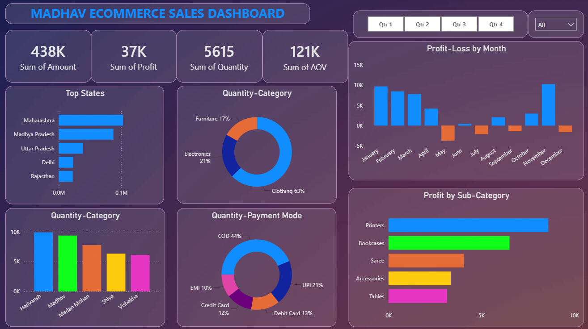

# Madhav Ecommerce Sales Dashboard

An interactive ecommerce sales analytics dashboard developed using Power BI to analyze sales performance, profit trends, product categories, payment modes, customer orders, and regional sales distribution.

## Project Overview

This project focuses on extracting meaningful business insights from ecommerce sales data using data visualization and business intelligence techniques.

The dashboard provides:

- Sales and profit performance analysis
- Monthly profit-loss analysis
- State-wise sales distribution
- Product category analysis
- Sub-category profit analysis
- Payment mode analysis
- Customer-wise quantity analysis
- Quarterly performance filtering

---

## Tools & Technologies Used

- Power BI
- DAX
- Power Query
- Data Analytics
- Data Visualization
- Business Intelligence
- Dashboard Design

---

## Dataset

Dataset Used: Ecommerce Sales Dataset

The dataset is divided into two tables:

### Orders

Contains order and customer-related information:

- Order ID
- Order Date
- Customer Name
- State
- City

### Details

Contains sales transaction information:

- Order ID
- Amount
- Profit
- Quantity
- Category
- Sub-Category
- Payment Mode

The two tables are connected using **Order ID**.

---

## Key Performance Indicators

- Total Sales Amount: **438K**
- Total Profit: **37K**
- Total Quantity: **5,615**
- Sum of AOV: **121K**

---

## Key Insights

### 1. Sales & Profit Overview

- The dashboard records approximately **438K** in total sales amount.
- Total profit is approximately **37K**.
- Total quantity sold is **5,615**.
- The dashboard provides quarterly filters to compare performance across **Qtr 1, Qtr 2, Qtr 3, and Qtr 4**.

### 2. Top States

The dashboard highlights the following states among the top sales contributors:

- Maharashtra
- Madhya Pradesh
- Uttar Pradesh
- Delhi
- Rajasthan

Maharashtra appears as the leading state in the dashboard's sales distribution.

### 3. Quantity by Category

The category distribution shows:

| Category | Quantity Share |
| -------- | -------------- |
| Clothing | 63% |
| Electronics | 21% |
| Furniture | 17% |

Clothing represents the largest share of quantity sold.

### 4. Quantity by Payment Mode

The dashboard analyzes sales quantity across different payment methods:

| Payment Mode | Share |
| ------------ | ----: |
| COD | 44% |
| UPI | 21% |
| Debit Card | 13% |
| Credit Card | 12% |
| EMI | 10% |

COD represents the largest share of quantity among the payment modes shown in the dashboard.

### 5. Profit-Loss by Month

The monthly analysis compares profitable and loss-making months.

- January, February, March, and April show positive profit.
- May shows a noticeable negative result.
- June records a small positive result.
- July, September, October, and December show negative results.
- November records one of the highest positive profit values in the dashboard.

This visualization helps identify monthly fluctuations in profitability.

### 6. Profit by Sub-Category

The dashboard highlights the following sub-categories:

| Sub-Category | Profit |
| ------------ | -----: |
| Printers | 8.6K |
| Bookcases | 6.5K |
| Saree | 4.1K |
| Accessories | 3.4K |
| Tables | 3.1K |

Printers generate the highest profit among the sub-categories shown.

### 7. Customer-wise Quantity Analysis

The dashboard compares quantity across selected customers, including:

- Harivansh
- Madhav
- Madan Mohan
- Shiva
- Vishakha

This helps compare customer-level purchase quantities.

---

## Business Impact

This dashboard can help:

- Ecommerce businesses monitor sales performance
- Identify profitable and loss-making months
- Understand product category demand
- Analyze sub-category profitability
- Compare regional sales performance
- Understand customer purchase quantities
- Analyze preferred payment methods
- Support data-driven sales and business decisions

---

## Future Improvements

- Customer segmentation and RFM analysis
- Customer lifetime value analysis
- Sales forecasting
- Profit forecasting
- Product-level profitability analysis
- Regional sales mapping
- Customer retention analysis
- Year-over-year sales comparison
- Advanced DAX measures
- Interactive drill-through analysis

---

## Dashboard Preview

  

---

## Conclusion

This project demonstrates practical Power BI, DAX, Power Query, and data visualization skills by converting ecommerce transaction data into an interactive sales analytics dashboard.

The analysis provides visibility into sales, profit, product categories, payment modes, sub-category performance, customer quantities, and regional distribution.

---

## Author

**Shree Gulumbe**
